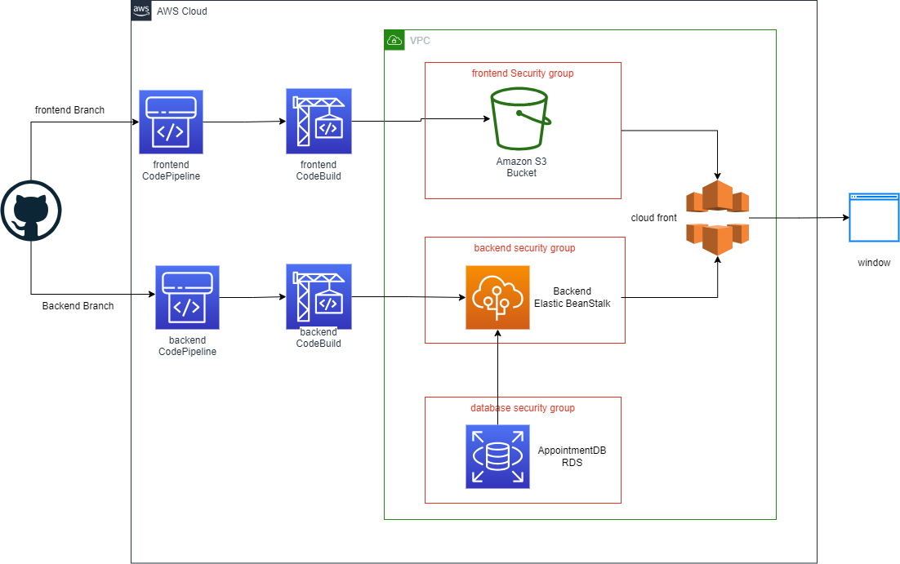
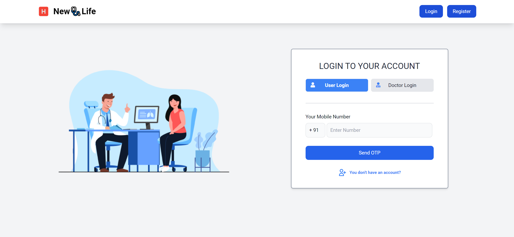
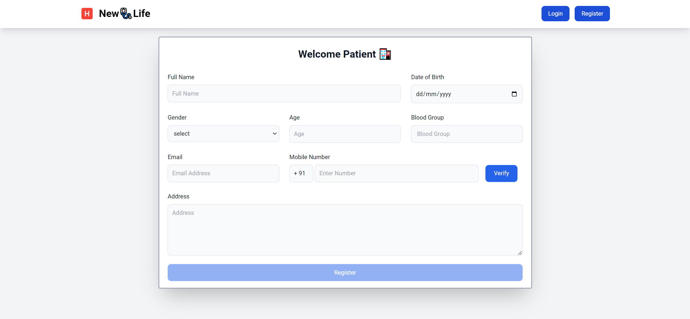
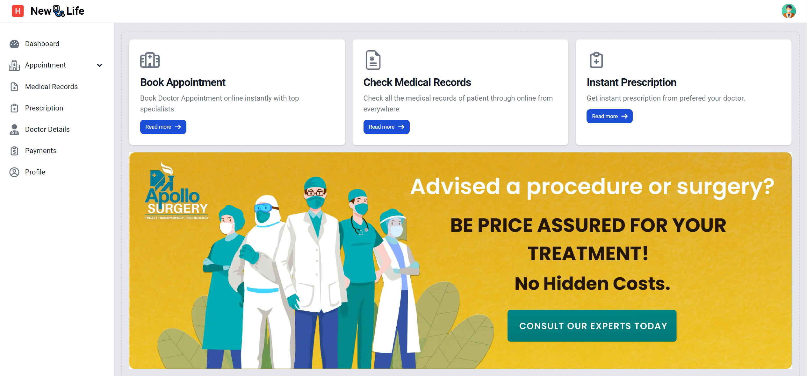
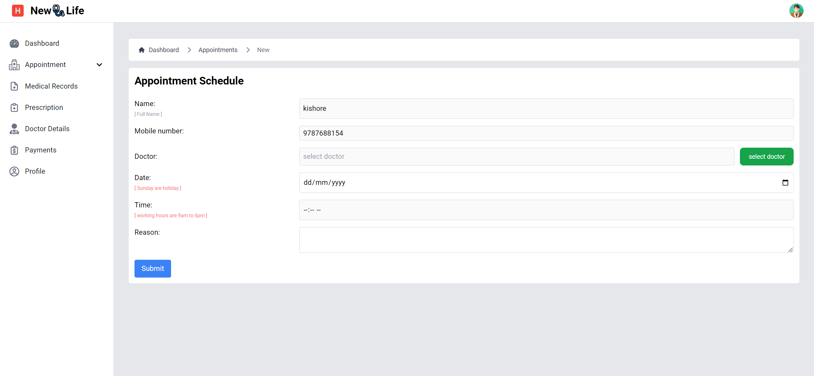
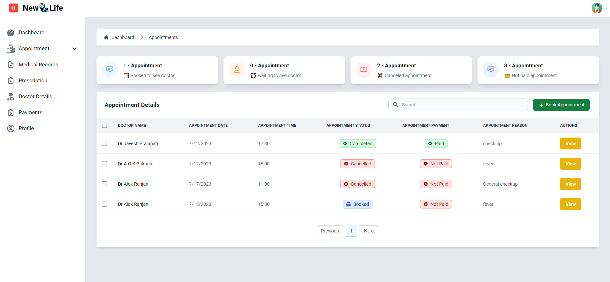
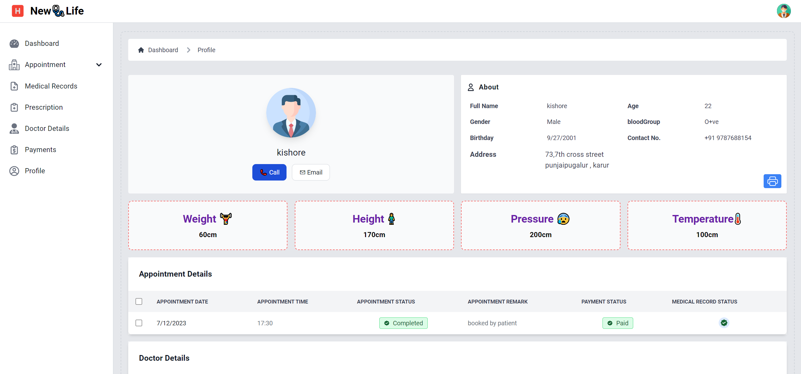
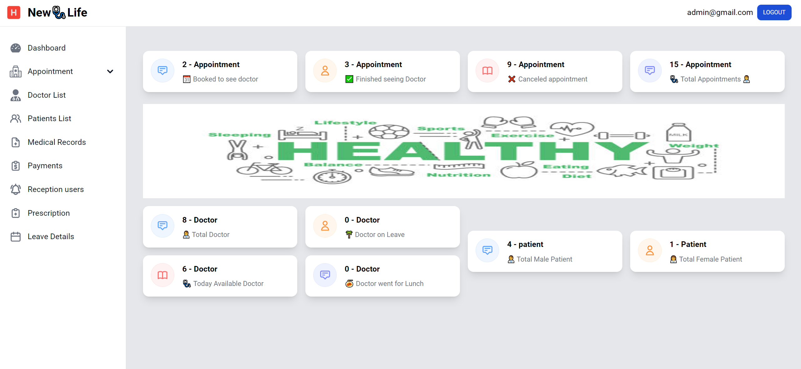
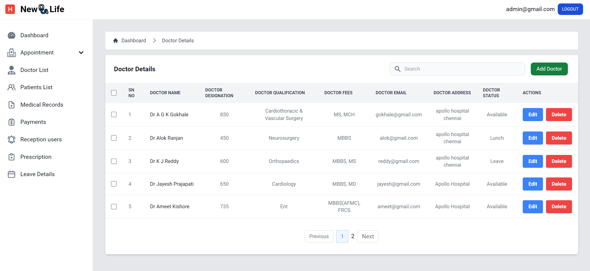

<h4 align="center" id="title">New🩺Life</h4>
<h1 align="center" id="title">Doctor Appointment Scheduler</h1>

## 🚀 Features

- [x] Online appointment booking
- [x] Doctor availability management
- [x] Patient profile management
- [x] Automated reminders
- [x] Medical Record Management

## ⚙️ Stacks

- **Frontend**: ReactJs, Tailwind Css
- **Backend**: C#, .NET Core Web API
- **Database**: SQL Server 
- **Recurring Dashboard**: Hangfire
- **Authentication**: Firebase
- **Email**: Mailkit

## 📐 Architecture diagram

## 🖥 Demo
[http://appointment-scheduler-frontend.s3-website-us-east-1.amazonaws.com/](http://appointment-scheduler-frontend.s3-website-us-east-1.amazonaws.com/)

## 💻 Snapshots

## Contributing

Contribute by raising an issue and give a PR.